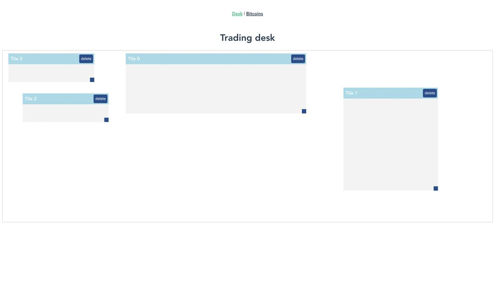
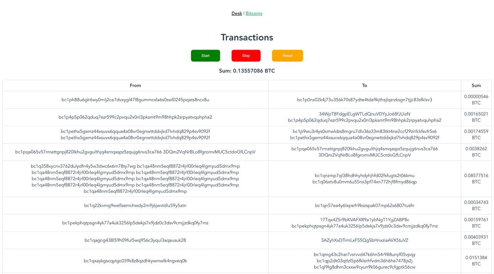

# Trading Dashboard App
A single-page application built using **Vue3** with lazy loading. It includes an interactive workspace where users can manage draggable and resizable blocks with persistent configurations. Additionally, it features a real-time Bitcoin transactions interface that uses WebSocket for subscribing to and displaying unconfirmed Bitcoin transactions.





## Project Feautures

- **Interactive Workspace:** Draggable blocks that can be repositioned on a grid with 10px increments. Resizable blocks along both axes. Persistent state across browser sessions. Block management allowing removed blocks to be added back to the center of the workspace with default dimensions. Clicking on blocks brings them to the front.

- **Real-time Bitcoin Transactions**: Integration with the Blockchain WebSocket API to subscribe to unconfirmed Bitcoin transactions. A continuously updated transaction list with a total sum displayed. User actions include starting and stopping the subscription to transactions and resetting the transaction list and total sum.

## Setup

Make sure to install dependencies:

```bash
# npm
npm install

# pnpm
pnpm install

# yarn
yarn install

# bun
bun install
```

## Development Server

Start the development server on `http://localhost:3000`:

```bash
# npm
npm run serve

# pnpm
pnpm serve

# yarn
yarn serve

# bun
bun run serve
```

## Production

Build the application for production:

```bash
# npm
npm run build

# pnpm
pnpm build

# yarn
yarn build

# bun
bun run build
```

## Docs Links
- **Vue 3**: `https://vuejs.org/`

